# PhotoMission 系統架構與流程圖

本文件包含 PhotoMission 攝影學習系統的完整架構圖和流程圖。

---

## 📐 系統架構圖

### 整體架構

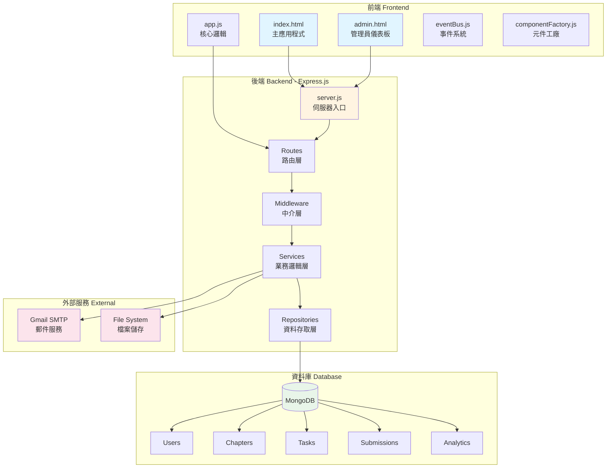

---

## 🔐 用戶認證流程

### 註冊與 Email 驗證流程

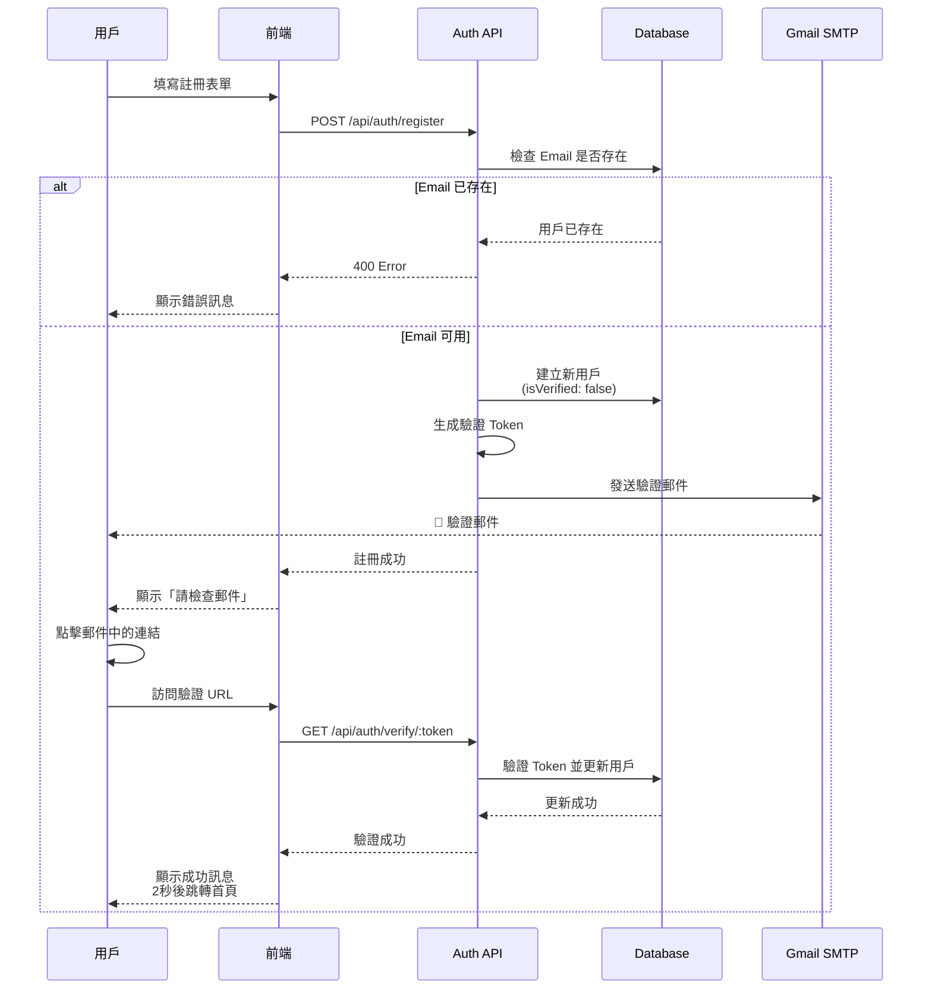

### 登入流程

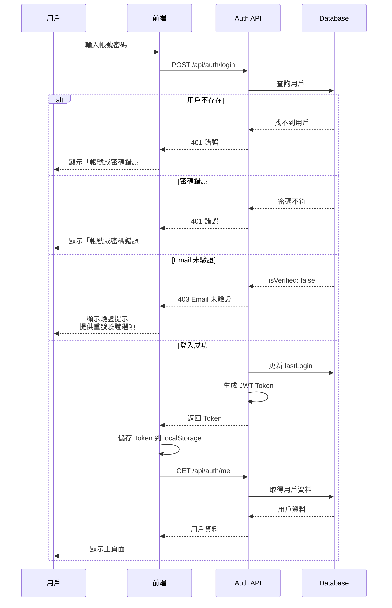

---

## 📸 作品提交流程

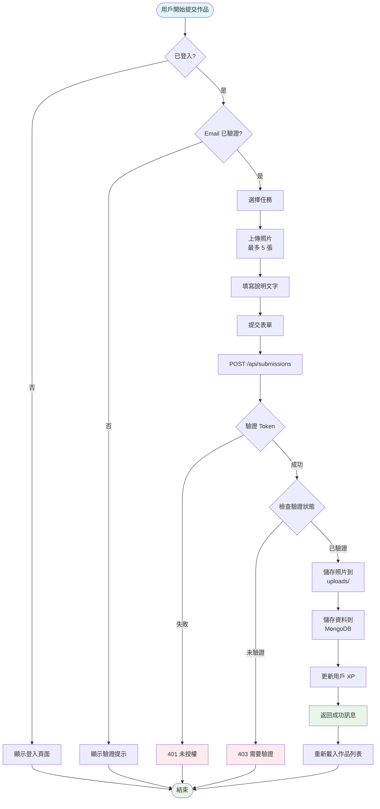

---

## � 完整 CRUD 流程圖

### CREATE - 建立作品流程

上方的「作品提交流程」已涵蓋 CREATE 操作。

---

### READ - 查詢作品流程

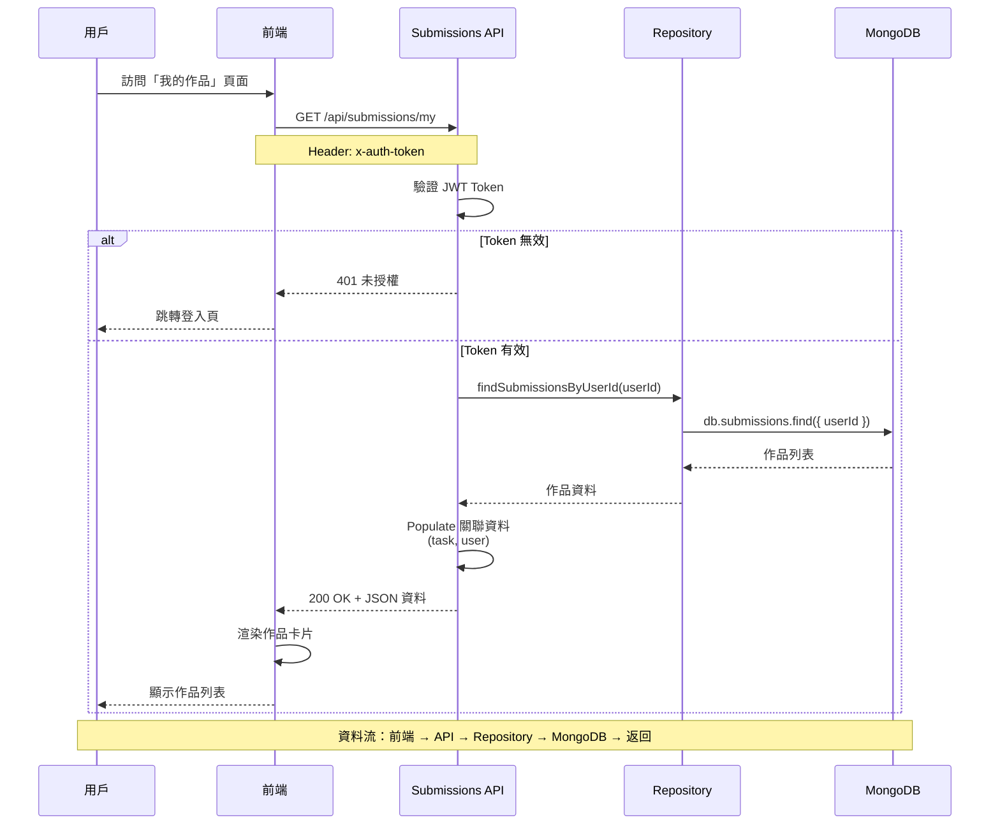

---

### UPDATE - 更新作品流程

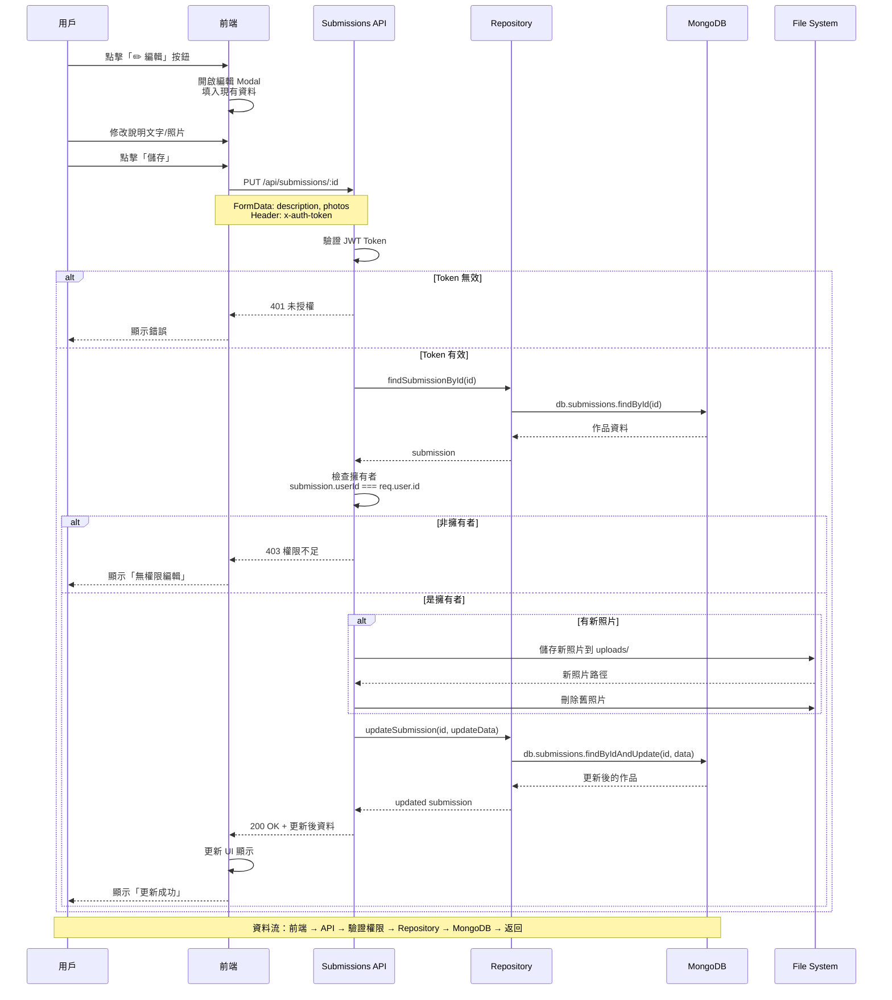

---

### DELETE - 刪除作品流程

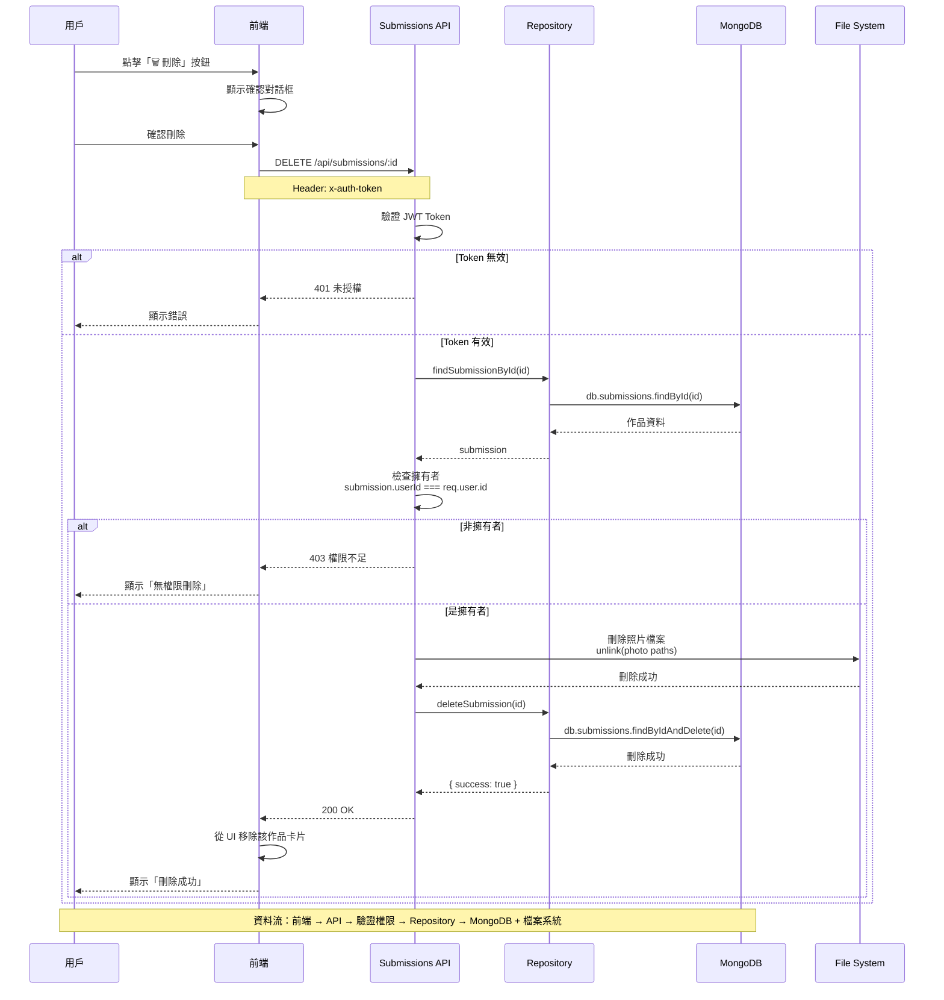

---

### CRUD 流程總覽

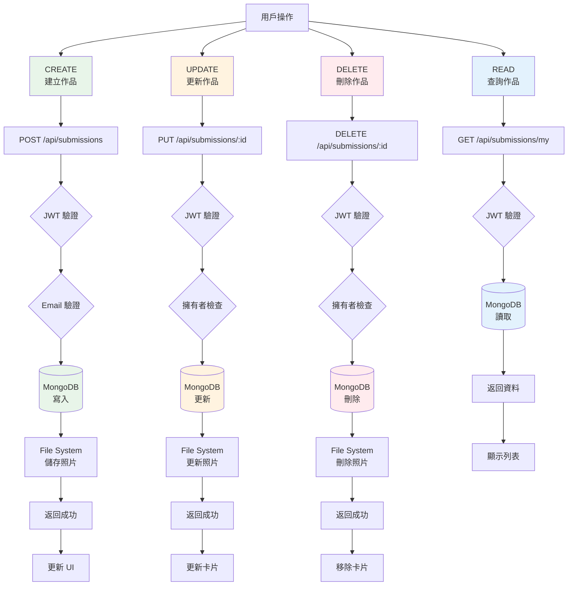

---

## �🔧 管理員分析系統

### 點擊追蹤流程

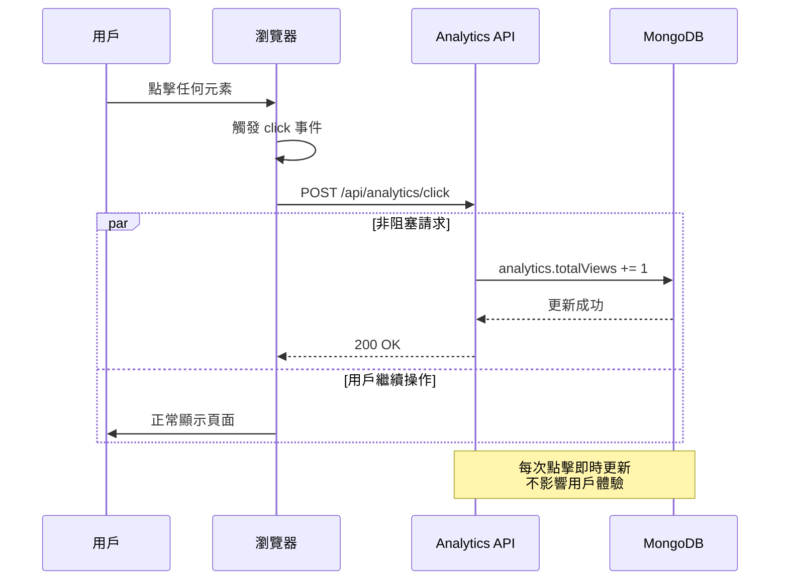

### 管理員儀表板流程

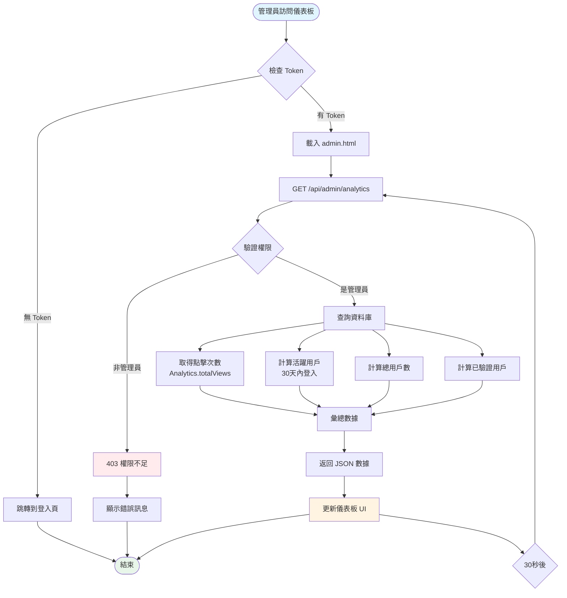

---

## 🗂️ 資料庫架構

### ER 圖 (Entity Relationship)

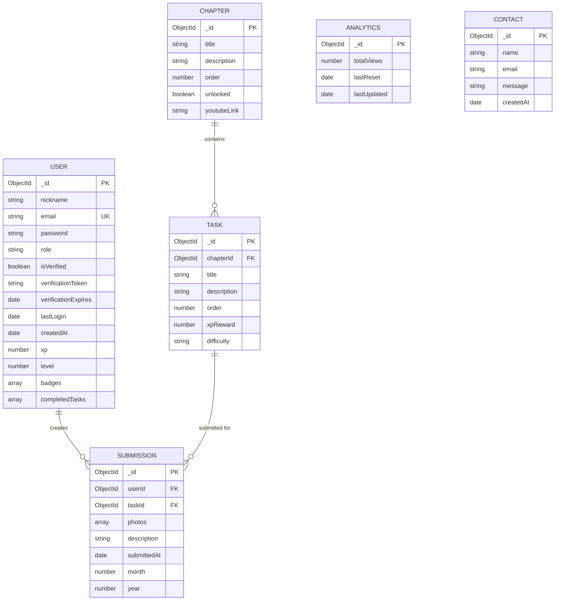

---

## 🔄 完整請求流程

### API 請求處理流程

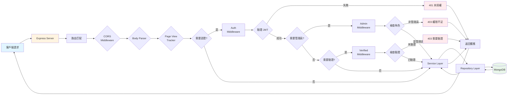

---

## 📱 前端狀態管理

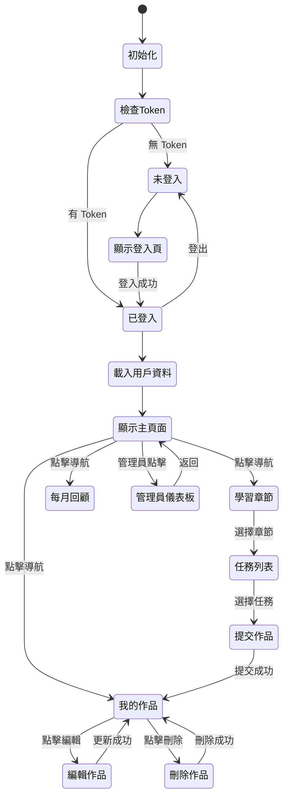

---

## 🎯 關鍵功能流程總結

### 1. 用戶註冊驗證
1. 用戶填寫註冊表單
2. 系統建立帳號（未驗證狀態）
3. 發送驗證郵件
4. 用戶點擊郵件連結
5. 系統驗證 Token 並啟用帳號
6. 自動跳轉到登入頁

### 2. 作品提交
1. 檢查登入狀態
2. 檢查 Email 驗證狀態
3. 選擇任務
4. 上傳照片（最多 5 張）
5. 填寫說明
6. 提交到後端
7. 儲存檔案和資料
8. 更新用戶 XP
9. 重新載入作品列表

### 3. 管理員分析
1. 前端監聽所有點擊事件
2. 發送點擊事件到 API
3. 後端即時更新計數器
4. 管理員訪問儀表板
5. 驗證管理員權限
6. 查詢並彙總數據
7. 返回 JSON 給前端
8. 更新 UI 顯示
9. 每 30 秒自動刷新

---

**圖表說明**：
- 🔵 藍色：前端/客戶端
- 🟡 黃色：後端/伺服器
- 🟢 綠色：資料庫/成功
- 🔴 紅色：錯誤/失敗
